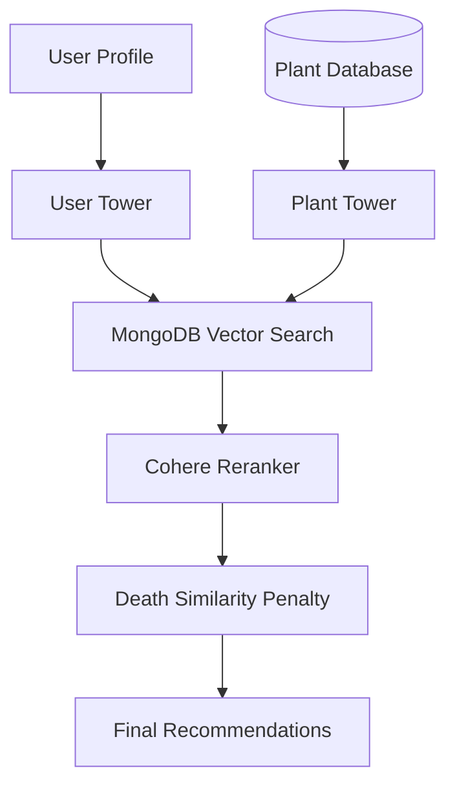
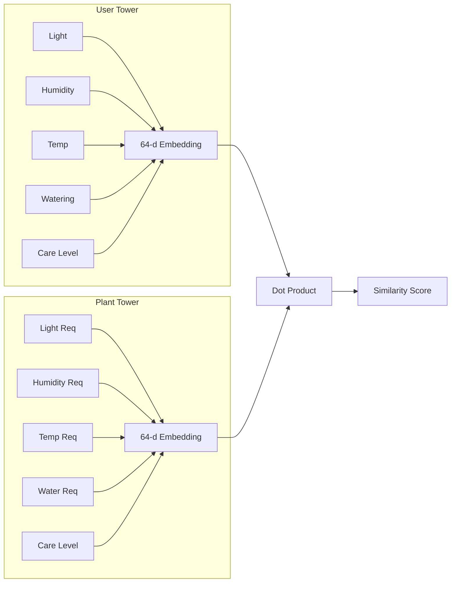
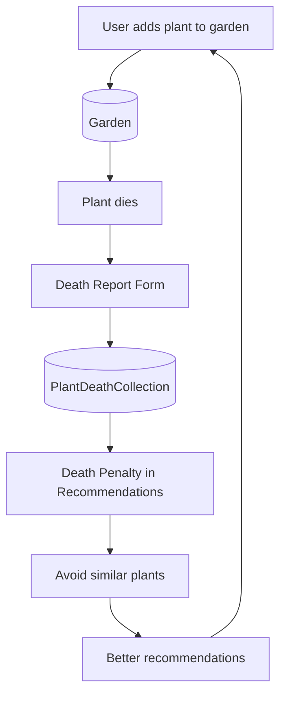

# 🌱 How To Keep Your Plants Alive

**HowToKeepYourPlantsAlive** is an intelligent plant recommendation system designed to **match plants to a user's real environment and learn from plant failures**.

Unlike traditional plant apps that recommend plants using static filters or popularity, this system uses **machine learning, semantic reranking, and failure-aware learning** to continuously improve plant recommendations.

This project is the V2 of the project developed for **SFHacks 2026** 

V1 : [HowToNotKillYourIndoorPlants](https://github.com/JaredAung/HowToNotKillYourIndoorPlants).

---

# 🚀 Key Innovations

### 🧠 ML Recommendation Engine

Uses a **Two-Tower neural network** to learn compatibility between **user environments** and **plant care requirements**.

### ⚡ Semantic Reranking

Improves recommendation quality using **Cohere semantic reranking**.

### 💀 Failure-Aware Recommendations

The system **learns from plants that died** and penalizes similar plants in future recommendations.

### 🤖 Conversational Plant Assistant

An **LLM-powered assistant** built with **LangGraph** allows users to explore, compare, and add plants using natural language.

### 🌿 Environment-Aware Profiles

Recommendations are based on **real user conditions**, including:

* Light availability
* Humidity
* Temperature
* Watering habits
* Care difficulty tolerance

### 🔄 Continuous Retraining

The model can be **retrained on real user data** — garden plants, deaths, and synthetic interactions. Real interactions are weighted higher. Run `python -m backend.recommend.retrain.retrain_two_tower` to retrain from production data.

### 📦 DVC Model Versioning

Model weights are versioned with **DVC** and stored in Google Drive. Track model updates, pull on fresh clones with `dvc pull`, and push new versions after retraining with `--dvc-add`.

---

# 🏗 System Architecture



---

# 🧠 Two-Tower Model Architecture



---

# 🔄 Death-Learning Feedback Loop



---

# 🧠 Recommendation Pipeline

The recommendation system operates in **three stages**.

---

## 1️⃣ Two-Tower Model (Candidate Retrieval)

A **two-tower deep learning model** embeds both **users** and **plants** into the same vector space.

### User Features

* Light conditions
* Humidity
* Temperature
* Watering preference
* Care difficulty tolerance

### Plant Features

* Light requirements
* Water requirements
* Humidity tolerance
* Temperature tolerance
* Care level

Both towers output **64-dimensional embeddings**.

MongoDB **vector search** retrieves candidate plants using **dot-product similarity**.

---

## 2️⃣ Semantic Reranking

The candidate list is reranked using the **Cohere Reranker**, which evaluates semantic relevance between:

* User environment description
* Plant descriptions

This improves ranking quality beyond structured matching.

---

## 3️⃣ Failure-Aware Learning (Death Penalty)

If a plant dies, the system **learns from that failure**.

Plants similar to previously dead plants receive a **score penalty**.

```
final_score = base_score − λ × similarity_to_dead_plants
```

This prevents recommending plants that **historically failed for the user**.

---

# 📊 Evaluation Metrics

**Current metrics:**

- [ ] Recall@K
- [ ] NDCG@K
- [ ] Hit Rate
- [ ] Latency (mean, p95)

**Add additional metrics:**

- [ ] Precision@K
- [ ] MAP (Mean Average Precision)
- [ ] Coverage
- [ ] Diversity

**Comparison table:**

| Model                     | Recall@5 | Recall@10 | Recall@20 | NDCG@5 | NDCG@10 | NDCG@20 | Hit@5 | Hit@10 | Hit@20 | Latency (mean) | Latency (p95) |
| ------------------------- | -------- | --------- | --------- | ------ | ------- | ------- | ----- | ------ | ------ | -------------- | ------------- |
| Profile Embedding Baseline | 0.2200   | 0.2978    | 0.3835    | 0.4881 | 0.4706  | 0.4395  | 0.68  | 0.71   | 0.74   | 25 ms          | 30 ms         |
| Rec Pipeline              | 0.2940   | 0.5166    | 0.8197    | 0.6889 | 0.7405  | 0.8111  | 0.94  | 0.97   | 1.00   | 1049 ms        | 1792 ms       |

**% improvement vs baseline (Rec Pipeline vs Profile Embedding Baseline):**

| Metric     | @5   | @10  | @20   |
| ---------- | ---- | ---- | ----- |
| Recall     | +34% | +73% | +114% |
| NDCG       | +41% | +57% | +85%  |
| Hit Rate   | +38% | +36% | +35%  |

---


# 🤖 LLM Chat Assistant

The application includes a **conversational assistant** built with **LangGraph**.

The assistant routes user intents to specialized actions.

### Supported Actions

| Action      | Description                              |
| ----------- | ---------------------------------------- |
| **EXPAND**  | Learn detailed information about a plant |
| **COMPARE** | Compare multiple plants                  |
| **PICK**    | Add a plant to your garden               |

---


# 🌿 Application Features

### Personalized Recommendations

Machine learning pipeline generates **environment-aware plant suggestions**.

### Home Feed

Displays **top plant recommendations** with optional AI explanations.

### Garden Tracking

Users can add plants to their personal garden and track them.

### Plant Care Profiles

Each plant includes detailed care information:

* Light
* Water
* Humidity
* Temperature
* Care difficulty

### Natural Language Search

Users can search using descriptions like:

> "Small plant that survives low light and doesn't need frequent watering."

The system extracts environmental constraints and returns matching plants.

### Death Reporting System

Users can report plant deaths with contextual data.

Fields include:

* What happened
* Watering frequency
* Plant location
* Humidity
* Room temperature

Death reports expire after **30 days using MongoDB TTL indexes**.

---

# 🧩 Technology Stack

| Layer               | Technologies                      |
| ------------------- | --------------------------------- |
| **Frontend**        | Next.js 16, React 19, TailwindCSS |
| **Backend**         | FastAPI                           |
| **Database**        | MongoDB Atlas                     |
| **Authentication**  | JWT                               |
| **ML Model**        | PyTorch Two-Tower Network         |
| **Embeddings**      | Voyage AI                         |
| **Reranking**       | Cohere                            |
| **LLM Framework**   | LangChain + LangGraph             |
| **LLM Runtime**     | Ollama                            |
| **External Search** | Tavily                            |
| **Model Versioning**| DVC (Google Drive)                |

---

# 📂 Project Structure

```
HowToKeepYourPlantsAlive
│
├── backend
│   ├── auth
│   ├── chat
│   ├── garden
│   ├── plant
│   ├── profile
│   ├── recommend
│   ├── search
│   ├── database
│   └── schemas
│
├── frontend
│   └── app
│       ├── auth
│       ├── garden
│       ├── plant
│       ├── profile
│       ├── onboarding
│       ├── agent
│       ├── search
│       └── chat
│
├── resources
│   ├── two_tower_training
│   ├── data_creating
│   └── schema
│
└── .env
```

---

# ⚙️ Setup

## Environment Variables

Create `.env` in the project root:

```env
# Required
MONGO_URI=mongodb+srv://...
MONGO_DATABASE=HowNotToKillYourPlants
JWT_SECRET=your-secret

# Collections (optional)
MONGO_USER_PROFILES_COLLECTION=UserCollection
MONGO_USER_GARDEN_COLLECTION=User_Garden_Collection
PLANT_DEATH_COLLECTION=PlantDeathCollection
PLANT_MONGO_COLLECTION=PlantCollection

# ML & APIs
VOYAGE_API_KEY=...
COHERE_API_KEY=...
TAVILY_API_KEY=...
VECTOR_SEARCH_INDEX=vector_index

# Optional
USE_RERANK=true
USE_DEATH_PENALTY=true
DEATH_PENALTY_LAMBDA=0.5
NEXT_PUBLIC_API_URL=http://localhost:8000
```

---

## MongoDB Vector Index

Create a vector search index on `PlantCollection`:

1. Atlas → Database → PlantCollection → Search Indexes
2. Create index (JSON editor) from `resources/vector_index_definition.json`
3. Index name must match `VECTOR_SEARCH_INDEX` (default: `vector_index`)

See `resources/VECTOR_INDEX_SETUP.md` for details.

---

## Backend

```bash
cd backend
pip install -r requirements.txt
```

---

## Train the Model

**Initial training** (synthetic data only):

```bash
python resources/two_tower_training/two_tower_training.py
```

**Retrain** (synthetic + real garden/death data from MongoDB, recommended):

```bash
python -m backend.recommend.retrain.retrain_two_tower
```

Outputs:

* `two_tower.pt`
* `plant_embeddings.json` (regenerated from model)

### Model versioning with DVC

Model weights (`two_tower.pt`) and metrics (`retrain_metrics.txt`) are tracked with [DVC](https://dvc.org/) and stored in [Google Drive](https://drive.google.com/drive/folders/1B3K2Tj_CKREKAbNBe7Iih8vlB19ZUQGH). `plant_embeddings.json` is regenerated from the model.

**Setup** (one-time):

```bash
pip install "dvc[gdrive]"
# Remote is preconfigured in .dvc/config
```

**Google Drive OAuth** (required — default DVC app is blocked by Google):

1. Create a [Google Cloud project](https://console.cloud.google.com/apis) and enable **Google Drive API**
2. Configure **OAuth consent screen** → add yourself as a **Test user** at [Auth audience](https://console.cloud.google.com/apis/credentials/consent)
3. Create **OAuth client ID** → Application type: **Desktop app**
4. Add redirect URI `http://localhost:8080/` in Credentials → your OAuth client → Authorized redirect URIs
5. Configure DVC:
   ```bash
   dvc remote modify storage gdrive_client_id 'YOUR_CLIENT_ID'
   dvc remote modify storage gdrive_client_secret 'YOUR_CLIENT_SECRET'
   ```
   Use `--local` to keep credentials out of the repo.

**After retraining** (to version the new model):

```bash
python -m backend.recommend.retrain.retrain_two_tower --dvc-add
git add resources/two_tower_training/output/*.dvc
git commit -m "Update model"
dvc push
```

**Pull model** (e.g. on a fresh clone):

```bash
dvc pull
```

**File locations:**

| What | Path |
|------|------|
| Model | `resources/two_tower_training/output/two_tower.pt` |
| Metrics | `resources/two_tower_training/output/retrain_metrics.txt` |
| Baseline vs rec | `resources/two_tower_training/output/baselineVs.txt` |
| DVC pointers | `*.dvc` in `resources/two_tower_training/output/` |
| Plant embeddings | `resources/two_tower_training/output/plant_embeddings.json` |
| Drive folder | [Google Drive](https://drive.google.com/drive/folders/1B3K2Tj_CKREKAbNBe7Iih8vlB19ZUQGH) |

**Prefect flow** (optional scheduling):

```bash
pip install prefect
python -m backend.recommend.retrain.prefect_flow
python -m backend.recommend.retrain.prefect_flow --dvc-push   # retrain + push to Drive
python -m backend.recommend.retrain.prefect_flow --no-use-eval  # skip baseline vs rec eval
```

---

## Upload Plant Data

```bash
python resources/data_creating/plant_data_clean.py
python resources/data_creating/upload.py
```

---

## Run Backend

```bash
cd backend
uvicorn main:app --reload
```

Backend runs at: **http://localhost:8000**

---

## Run Frontend

```bash
cd frontend
npm install
npm run dev
```

Frontend runs at: **http://localhost:3000**

---

