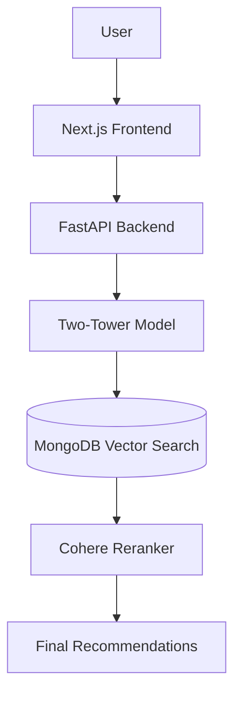
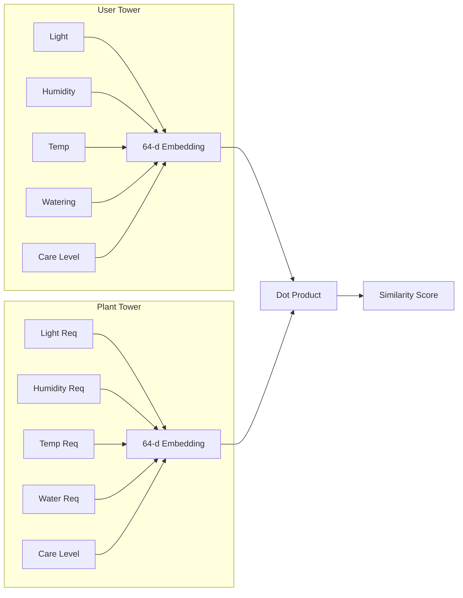
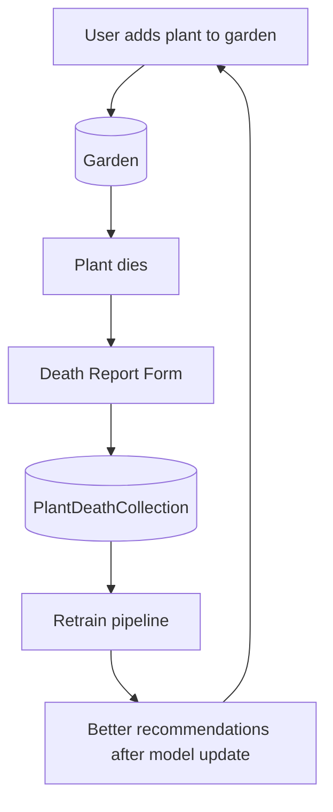
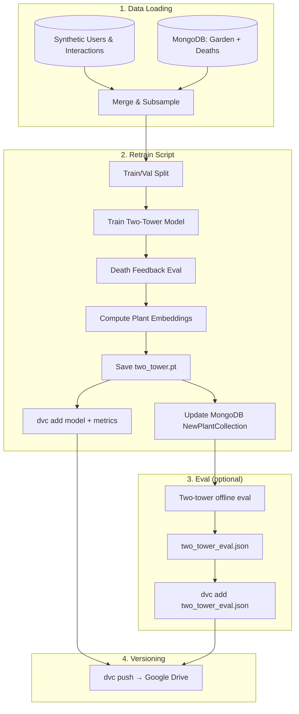

# 🌱 How To Keep Your Plants Alive

**HowToKeepYourPlantsAlive** is an intelligent plant recommendation system designed to **match plants to a user's real environment and learn from plant failures**.

Unlike traditional plant apps that recommend plants using static filters or popularity, this system uses **machine learning, semantic reranking, and failure-aware learning** to continuously improve plant recommendations.

This project is the V2 of the project developed for **SFHacks 2026** 

V1 : [HowToNotKillYourIndoorPlants](https://github.com/JaredAung/HowToNotKillYourIndoorPlants).

---

Live Website : [https://how-to-not-kill-your-plants.vercel.app] 

---
# Branch Info

### 🔹 `main` — Production / Stable Branch
The deployed version of the application.

Includes:
- Two-tower recommendation pipeline (trained on synthetic interaction data)
- Semantic reranking layer
- LangGraph chatbot for plant exploration and Q&A
- FastAPI-based backend with low-latency inference

This branch represents the **end-to-end working system**.

---

### 🔹 `v2` — Experimental ML Improvements
Focused on improving recommendation quality.

Includes:
- Training on **behaviorally realistic synthetic interaction data**
- Improved feature design and user–plant interaction modeling
- Ongoing experimentation with ranking performance and evaluation metrics

This branch is used for **model iteration and evaluation improvements**.

---

### 🔹 `rag_development` — RAG & Knowledge Grounding
Focused on enhancing chatbot intelligence through document retrieval.

Includes:
- Ingestion of external plant knowledge sources (e.g., Wikipedia)
- Document chunking and embedding for retrieval
- Retrieval-augmented generation (RAG) for grounded Q&A
- Integration with LangGraph for context-aware responses

This branch extends the system toward a **fully grounded, explainable AI assistant**.

---

# 🚀 Key Innovations

### 🧠 ML Recommendation Engine

Uses a **Two-Tower neural network** to learn compatibility between **user environments** and **plant care requirements**.

### ⚡ Semantic Reranking

Improves recommendation quality using **Cohere semantic reranking**.

### 💀 Failure-Aware Recommendations

The system **learns from plants that died** and penalizes similar plants in future recommendations.

### 🤖 Conversational Plant Assistant

An **LLM-powered assistant** built with **LangGraph** allows users to explore, compare, and add plants using natural language.

### 🌿 Environment-Aware Profiles

Recommendations are based on **real user conditions**, including:

* Light availability
* Humidity
* Temperature
* Watering habits
* Care difficulty tolerance

### 🔄 Continuous Learning Pipeline

The model **retrains on synthetic and real signals** — garden plants, deaths (as negatives), and synthetic interactions — when you run the training script. Refresh interaction exports / Feast materialization as needed, then train and version artifacts with DVC.

### 📦 DVC Model Versioning

Model weights are versioned with **DVC** and stored in Google Drive. Track model updates, pull on fresh clones with `dvc pull`, and push new versions after retraining with `--dvc-add`.

---

# 📊 Dataset

| Component | Count / Details |
| --------- | --------------- |
| **Plant catalog** | 400 plants |
| **Plant features** | Structured features (light, humidity, water, temp, care level, size, climate) + description embeddings (Voyage) |
| **Synthetic interactions** | 810 users (9 personas), ~11,200 interactions |
| **Real interactions (MongoDB)** | Garden adds (positive), plant deaths (negative), sampled negatives |

---

# 🏗 System Architecture

End-to-end flow from user request to recommendations:


```mermaid
flowchart TD
    User[User]
    User --> NextJS[Next.js Frontend]
    NextJS --> FastAPI[FastAPI Backend]
    FastAPI --> TwoTower[Two-Tower Model]
    TwoTower --> MongoVec[(MongoDB Vector Search)]
    MongoVec --> Cohere[Cohere Reranker]
    Cohere --> Results[Final Recommendations]
```

**Component flow:** User → Next.js frontend → FastAPI backend → Two-Tower model (user embedding) → MongoDB vector search (plant embeddings) → Cohere semantic reranker → ranked results.

---

# 🧠 Two-Tower Model Architecture


```mermaid
flowchart LR

subgraph UserTower[User Tower]
    U_Light[Light]
    U_Hum[Humidity]
    U_Temp[Temp]
    U_Water[Watering]
    U_Care[Care Level]
    U_Light --> U_Embed[64-d Embedding]
    U_Hum --> U_Embed
    U_Temp --> U_Embed
    U_Water --> U_Embed
    U_Care --> U_Embed
end

subgraph PlantTower[Plant Tower]
    P_Light[Light Req]
    P_Hum[Humidity Req]
    P_Temp[Temp Req]
    P_Water[Water Req]
    P_Care[Care Level]
    P_Light --> P_Embed[64-d Embedding]
    P_Hum --> P_Embed
    P_Temp --> P_Embed
    P_Water --> P_Embed
    P_Care --> P_Embed
end

U_Embed --> DotProduct[Dot Product]
P_Embed --> DotProduct
DotProduct --> Score[Similarity Score]
```

---

# 🧠 Training Objective

The two-tower model is trained as a **binary compatibility classifier**.

| Sample type | Source |
| ----------- | ------ |
| **Positive** | Plants added to user garden |
| **Negative** | Death reports, sampled plants not in garden |

**Loss function:** Binary Cross Entropy with weighted samples. Real interactions (garden adds, deaths) are weighted higher than synthetic data to ensure the model learns from production feedback.

---

# 🧠 Recommendation Pipeline

The recommendation system operates in **three stages**.

---

## 1️⃣ Two-Tower Model (Candidate Retrieval)

A **two-tower deep learning model** embeds both **users** and **plants** into the same vector space.

### User Features

* Light conditions
* Humidity
* Temperature
* Watering preference
* Care difficulty tolerance

### Plant Features

* Light requirements
* Water requirements
* Humidity tolerance
* Temperature tolerance
* Care level

Both towers output **64-dimensional embeddings**.

MongoDB **vector search** retrieves candidate plants using **dot-product similarity**.

---

## 2️⃣ Semantic Reranking

The candidate list is reranked using the **Cohere Reranker**, which evaluates semantic relevance between:

* User environment description
* Plant descriptions

This improves ranking quality beyond structured matching.

---

## 3️⃣ Failure-Aware Learning

If a plant dies, that signal is stored and can feed **the next training run** as a negative example (alongside garden positives and synthetic data). Recommendations at request time use vector retrieval and optional reranking only — there is **no separate runtime death-penalty term** on scores.

---

# 🔄 Death-Learning Feedback Loop

When a user reports a plant death, that signal flows back into the system:


```mermaid
flowchart TD

User[User adds plant to garden]
User --> Garden[(Garden)]
Garden --> PlantDies[Plant dies]
PlantDies --> DeathReport[Death Report Form]
DeathReport --> DeathDB[(PlantDeathCollection)]
DeathDB --> Retrain[Retrain pipeline]
Retrain --> BetterRecs[Better recommendations after model update]
BetterRecs --> User
```

**How it works:** Death reports are stored in `PlantDeathCollection` and used as **negative training signals** when the two-tower model is retrained, so the learned embeddings reflect failures over time. There is no separate runtime “death penalty” in the recommend API.

---

# 🔄 Automated Retraining Pipeline

The system improves over time by **retraining** when you rebuild interactions/features and run the training script (manually, via cron, or any orchestrator you prefer).


```mermaid
flowchart TD
    subgraph Data["1. Data Loading"]
        Synthetic[(Synthetic Users & Interactions)]
        Mongo[(MongoDB: Garden + Deaths)]
        Synthetic --> Merge[Merge & Subsample]
        Mongo --> Merge
    end

    subgraph Train["2. Retrain Script"]
        Merge --> Split[Train/Val Split]
        Split --> TrainLoop[Train Two-Tower Model]
        TrainLoop --> DeathEval[Death Feedback Eval]
        DeathEval --> Embed[Compute Plant Embeddings]
        Embed --> Save[Save two_tower.pt]
        Save --> MongoUpdate[Update MongoDB NewPlantCollection]
        Save --> DVCAdd1[dvc add model + metrics]
    end

    subgraph Eval["3. Eval (optional)"]
        MongoUpdate --> TwoTowerEval[Two-tower offline eval]
        TwoTowerEval --> EvalJson[two_tower_eval.json]
        EvalJson --> DVCAdd2[dvc add two_tower_eval.json]
    end

    subgraph Version["4. Versioning"]
        DVCAdd1 --> DVCPush
        DVCAdd2 --> DVCPush[dvc push → Google Drive]
    end
```

**Typical flow:** train (`python resources/two_tower_training/training_script.py`) → optional eval (`python resources/two_tower_training/eval.py`) → `dvc add` / `dvc push` for artifacts under `resources/two_tower_training/output/`.

**Deaths and retraining:** Retraining incorporates garden and death data so the model learns from real failures; recommendations at request time use vector search and optional reranking only.

---

# 📊 Evaluation Metrics

**Current metrics:**

- [ ] Recall@K
- [ ] NDCG@K
- [ ] Hit Rate
- [ ] Latency (mean, p95)

**Add additional metrics:**

- [ ] Precision@K
- [ ] MAP (Mean Average Precision)
- [ ] Coverage
- [ ] Diversity

**Comparison table:**

| Model                     | Recall@5 | Recall@10 | Recall@20 | NDCG@5 | NDCG@10 | NDCG@20 | Hit@5 | Hit@10 | Hit@20 | Latency (mean) | Latency (p95) |
| ------------------------- | -------- | --------- | --------- | ------ | ------- | ------- | ----- | ------ | ------ | -------------- | ------------- |
| Profile Embedding Baseline | 0.2200   | 0.2978    | 0.3835    | 0.4881 | 0.4706  | 0.4395  | 0.68  | 0.71   | 0.74   | 25 ms          | 30 ms         |
| Rec Pipeline              | 0.2940   | 0.5166    | 0.8197    | 0.6889 | 0.7405  | 0.8111  | 0.94  | 0.97   | 1.00   | 1049 ms        | 1792 ms       |

**% improvement vs baseline (Rec Pipeline vs Profile Embedding Baseline):**

| Metric     | @5   | @10  | @20   |
| ---------- | ---- | ---- | ----- |
| Recall     | +34% | +73% | +114% |
| NDCG       | +41% | +57% | +85%  |
| Hit Rate   | +38% | +36% | +35%  |

**Latency:** The pipeline (~1049 ms) is ~40× slower than the baseline (~25 ms). Latency is primarily introduced by the **semantic reranking stage** (~900 ms via Cohere API). Future optimizations: replace external reranker with a local cross-encoder, cache plant embeddings, reduce candidate size before reranking.

---

# 🧪 Synthetic Data Generation

The model is bootstrapped with synthetic data before any real users exist. The pipeline generates realistic user-plant interactions with ground-truth survival labels via a deterministic **oracle**.

## Pipeline

```
personas.json → generate_users.py → synthetic_users.json
                                          ↓
plants catalog + synthetic_users → generate_interactions.py → synthetic_interactions.json
```

1. **`generate_users.py`** — creates 810 synthetic users from 9 persona templates (`overconfident_beginner`, `nervous_nurturer`, `serial_experimenter`, `specialist`, `recovering_killer`, `collector`, `climate_mismatch`, `impulsive_buyer`, `researcher`). Each persona defines care level, climate, zone range, and feature distributions. Users are sampled with balanced randomization within each persona's pool.

2. **`generate_interactions.py`** — assigns plants to users via persona-driven selection, computes an `oracle_score` for each user-plant pair, and stochastically generates survival labels.

## Oracle Score

The oracle computes a **weighted compatibility score** (0–1) between user environment and plant requirements across 6 features:

| Feature | Weight | Scoring |
|---------|--------|---------|
| Light | 0.22 | Ordinal distance: `1/(1+distance)` on `[full shade, partial, full sun]` |
| Water | 0.27 | Distance outside `[ideal_days, tolerated_days]`: `1/(1+distance)` |
| Soil | 0.18 | Ordinal distance: `1/(1+distance)` on `[light, medium, heavy]` |
| Care level | 0.13 | Asymmetric: `user_skill >= plant_difficulty` is fine; lower skill is penalized |
| Climate | 0.10 | Ordinal distance on `[alpine, arid, mediterranean, temperate, tropical]` |
| Zone | 0.10 | Continuous partial credit: `overlap / user_zone_span` |

A **cumulative mismatch decay** (`MISMATCH_DECAY = 0.87`) multiplies the score for each imperfect feature, making multiple small mismatches compound: `final = base × 0.87^num_mismatches`.

## Survival Label Generation

The oracle score is modified before stochastic label sampling:

1. **Overload penalty** — if a user's total plant `difficulty_score` exceeds their care-level threshold (`easy=100`, `medium=200`, `hard=400`), survival is reduced: `penalty = (1 - 1/(1 + 0.20 × excess/100)) × 0.18`
2. **Persona survival bonus** — a flat modifier per persona (ranges from -0.03 to -0.45)
3. **Baseline boost** (+0.55) — shifts overall positive rate to 65–80%
4. **Clamp** to [0.05, 0.95] and **stochastic sampling** — `label = 1 if random() < survival_prob else 0`

## Persona-Driven Plant Selection

Each persona has a selection strategy that biases which plants a user receives:

| Strategy | Personas | Effect |
|----------|----------|--------|
| `oracle_positive` | researcher, nervous_nurturer | Preferentially picks high-compatibility plants |
| `oracle_negative` | overconfident_beginner | Picks low-compatibility plants |
| `oracle_trend` | recovering_killer | Early plants = bad matches, late = good (learning arc) |
| `care_hard` | serial_experimenter | Weights hard-care plants 2× |
| `niche` | specialist | Weights dry/low-water plants 3× |
| `climate_bias` | climate_mismatch | Weights tropical plants 2× (despite alpine zone) |
| `diversity` | collector | Maximizes variety across layer, climate, family |
| `random` | impulsive_buyer | No bias |

---

# 🔍 Model Verification & Findings

After training, we verified whether the two-tower model learned the oracle's encoded patterns. Each pattern was analyzed in a dedicated notebook under `resources/verify/`.

## Verified Patterns

### 1. Feature Priority (`feature compactability/`)

**Oracle:** Care and light mismatches should be most detrimental.

**Finding: Confirmed.** Survival drop when mismatched:

| Feature | Survival Drop | Model Score Drop |
|---------|--------------|-----------------|
| Care | 0.180 (highest) | Highest |
| Light | 0.142 | Second |
| Climate | 0.132 | — |
| Zone | 0.127 | — |
| Water | 0.127 | — |
| Soil | 0.094 (lowest) | Lowest |

The model correctly ranks care and light as the top two most impactful features.

### 2. Cumulative Mismatch Penalty (`cumulative mismatch/`)

**Oracle:** `MISMATCH_DECAY = 0.87` compounds per mismatch — 4 mismatches yields `0.87⁴ ≈ 0.57×` score.

**Finding: Confirmed.** Both survival rate and model score drop non-linearly as mismatch count increases, matching the compound decay curve.

### 3. Ordinal Penalties (`ordinal penalities/`)

**Oracle:** Light, soil, and climate use `1/(1+distance)` on ordinal scales, giving partial credit for near-misses.

**Finding: Confirmed.** Survival and model scores decrease gradually with ordinal distance. Distance=1 is penalized less than distance=2, matching the gradual curve.

### 4. Zone Partial Overlap (`zone overlap/`)

**Oracle:** USDA zones use continuous `overlap / user_span` rather than binary match.

**Finding: Confirmed.** Survival rate increases from ~0.55 (overlap=0) to ~0.85 (overlap=4) following a smooth gradient. The model tracks this trend with a strong upward slope.

### 5. Water Gradual Penalty (`water gradual/`)

**Oracle:** Water frequency outside `[ideal_days, tolerated_days]` is penalized by `1/(1+distance)`.

**Finding: Confirmed.** The three-bucket analysis (below / in range / above) clearly shows "in range" with highest survival (~0.80), and both under-watering and over-watering penalized. The model mirrors this pattern.

### 6. Overload Penalty (`overload penalty/`)

**Oracle:** When total plant difficulty exceeds care-level thresholds, survival drops gradually.

**Finding: Partially confirmed.** Survival clearly decreases as excess difficulty increases within each care level. The model shows some sensitivity but the signal is weaker — this is a **user-level aggregate effect** that the model can only infer indirectly from embeddings.

### 7. Persona Effects (`persona effects/`)

**Oracle:** 9 personas with different selection strategies, portfolio sizes, and survival bonuses create varying survival rates.

**Finding: Partially confirmed.**

- Survival ranking across personas matches the oracle's design exactly (worst: `collector` at ~0.44, best: `specialist` at ~0.89).
- Survival ↔ model score correlation: **r = 0.455** (moderate positive).
- The model correctly assigns lower scores to personas with poor feature matches (`overconfident_beginner`, `impulsive_buyer`) and higher scores to well-matched ones (`specialist`, `researcher`).

## Summary of Model Strengths & Limitations

### What the Model Learns Well

- **Feature-level compatibility** — care, light, soil, water, zone, climate matching are all captured with correct priority ranking.
- **Gradual penalties** — ordinal distances, zone overlap fractions, and water proximity are learned as smooth gradients, not binary thresholds.
- **Compound mismatch decay** — multiple mismatches are penalized non-linearly, matching the oracle's design.
- **Persona separation via features** — personas that create genuinely poor feature matches get low model scores.

### What the Model Struggles With

- **User-level aggregate effects** — the overload penalty (based on total portfolio difficulty) is weakly captured because it's not a pairwise feature; it depends on the user's entire plant collection.
- **Hidden survival bonuses** — the oracle's flat per-persona `survival_bonus` (up to -0.45) is invisible to the model since persona identity isn't in the embedding. Oracle bonus ↔ model correlation is only **r = 0.313**.
- **Behavioral patterns** — personas like `nervous_nurturer` (high survival through safe choices) get unexpectedly low model scores because their conservative feature matches don't produce high dot-product similarity.

### Interpretation

The model is designed for **pairwise user-plant compatibility scoring**, and it does this well. The limitations are by design — effects that depend on the user's full portfolio (overload) or hidden modifiers (persona bonus) cannot be captured from a single user-plant embedding pair. For a recommendation system, this is the correct behavior: the model recommends plants that are a good feature match, while portfolio-level concerns (overload, diversity) would need to be handled at a higher layer.

---


# 🤖 LLM Chat Assistant

The application includes a **conversational assistant** built with **LangGraph**.

The assistant routes user intents to specialized actions.

### Supported Actions

| Action      | Description                              |
| ----------- | ---------------------------------------- |
| **EXPAND**  | Learn detailed information about a plant |
| **COMPARE** | Compare multiple plants                  |
| **PICK**    | Add a plant to your garden               |

---


# 🌿 Application Features

### Personalized Recommendations

Machine learning pipeline generates **environment-aware plant suggestions**.

### Home Feed

Displays **top plant recommendations** with optional AI explanations.

### Garden Tracking

Users can add plants to their personal garden and track them.

### Plant Care Profiles

Each plant includes detailed care information:

* Light
* Water
* Humidity
* Temperature
* Care difficulty

### Natural Language Search

Users can search using descriptions like:

> "Small plant that survives low light and doesn't need frequent watering."

The system extracts environmental constraints and returns matching plants.

### Death Reporting System

Users can report plant deaths with contextual data.

Fields include:

* What happened
* Watering frequency
* Plant location
* Humidity
* Room temperature

Death reports expire after **30 days using MongoDB TTL indexes**.

---

# 📸 Application Screenshots

| Page | Description |
| ---- | ----------- |
| Recommendation page | Top plant suggestions with AI explanations |
| Plant details page | Care profile, light/water/humidity requirements |
| Death reporting form | Contextual feedback when a plant dies |
| Chat assistant | Natural language plant exploration |
| Garden page | User's tracked plants |

*Add screenshots to showcase the application.*

---

# 🚀 Deployment Architecture

| Component | Platform |
| --------- | -------- |
| **Frontend** | Vercel |
| **Backend** | FastAPI (Railway / Fly.io) |
| **Database** | MongoDB Atlas |
| **Retraining** | Prefect workflow |
| **Artifacts** | DVC + Google Drive |

See **[DEPLOYMENT.md](DEPLOYMENT.md)** for step-by-step deployment instructions.

---

# 🧩 Technology Stack

| Layer               | Technologies                      |
| ------------------- | --------------------------------- |
| **Frontend**        | Next.js 16, React 19, TailwindCSS |
| **Backend**         | FastAPI                           |
| **Database**        | MongoDB Atlas                     |
| **Authentication**  | JWT                               |
| **ML Model**        | PyTorch Two-Tower Network         |
| **Embeddings**      | Voyage AI                         |
| **Reranking**       | Cohere                            |
| **LLM Framework**   | LangChain + LangGraph             |
| **LLM Runtime**     | Google Gemini                     |
| **External Search** | Tavily                            |
| **Model Versioning**| DVC (Google Drive)                |

---

# 📂 Project Structure

```
HowToKeepYourPlantsAlive
│
├── backend
│   ├── auth
│   ├── chat
│   ├── garden
│   ├── plant
│   ├── profile
│   ├── recommend
│   ├── search
│   ├── database
│   └── schemas
│
├── frontend
│   └── app
│       ├── auth
│       ├── garden
│       ├── plant
│       ├── profile
│       ├── onboarding
│       ├── agent
│       ├── search
│       └── chat
│
├── resources
│   ├── two_tower_training
│   ├── data_creating
│   ├── synthetic_user
│   ├── data
│   ├── ETL
│   ├── verify
│   │   ├── feature compactability
│   │   ├── cumulative mismatch
│   │   ├── ordinal penalities
│   │   ├── zone overlap
│   │   ├── water gradual
│   │   ├── overload penalty
│   │   └── persona effects
│   └── schema
│
└── .env
```

---

# ⚙️ Setup

## Environment Variables

Create `.env` in the project root:

```env
# Required
MONGO_URI=mongodb+srv://...
MONGO_DATABASE=HowNotToKillYourPlants
JWT_SECRET=your-secret

# Collections (optional)
MONGO_USER_PROFILES_COLLECTION=UserCollection
MONGO_USER_GARDEN_COLLECTION=User_Garden_Collection
PLANT_DEATH_COLLECTION=PlantDeathCollection
NEW_PLANT_COLLECTION=NewPlantCollection

# ML & APIs
VOYAGE_API_KEY=...
COHERE_API_KEY=...
TAVILY_API_KEY=...
VECTOR_SEARCH_INDEX=vector_index

# Optional
USE_RERANK=true
NEXT_PUBLIC_API_URL=http://localhost:8000

# LLM: Google Gemini (LangGraph, search, recommendation text)
GEMINI_API_KEY=...
# Optional: GEMINI_MODEL=gemini-2.5-flash
```

---

## MongoDB Vector Index

Create a vector search index on your plant catalog (default `NewPlantCollection`; set `NEW_PLANT_COLLECTION` to match):

1. Atlas → Database → (your plant collection) → Search Indexes
2. Create index (JSON editor) from `resources/vector_index_definition.json`
3. Index name must match `VECTOR_SEARCH_INDEX` (default: `vector_index`)

See `resources/VECTOR_INDEX_SETUP.md` for details.

---

## Backend

```bash
cd backend
pip install -r requirements.txt
```

---

## Train the Model

From the repo root:

```bash
python resources/two_tower_training/training_script.py
```

Use **`resources/two_tower_training/synthetic_interactions.json`** (and Feast / feature materialization as configured in `training_script.py`) as training inputs. For the old Mongo-merge + weighted retrain helper, restore **`backend/recommend/retrain/`** from git history.

**Artifacts**

* **Checkpoint:** `resources/two_tower_training/two_tower.pt` (dict with `model_state`, `epoch`, `val_metrics`).
* **Metrics / runs:** optional **MLflow** logging when `MLFLOW_TRACKING_URI` is set (`./mlruns` by default).

### Model versioning with DVC

Track **`two_tower.pt`** (and any other artifacts you rely on) with [DVC](https://dvc.org/). Remote Storage may point at [Google Drive](https://drive.google.com/drive/folders/1B3K2Tj_CKREKAbNBe7Iih8vlB19ZUQGH) depending on your `.dvc/config`.

**Setup** (one-time):

```bash
pip install "dvc[gdrive]"
# Remote is preconfigured in .dvc/config
```

**Google Drive OAuth** (required — default DVC app is blocked by Google):

1. Create a [Google Cloud project](https://console.cloud.google.com/apis) and enable **Google Drive API**
2. Configure **OAuth consent screen** → add yourself as a **Test user** at [Auth audience](https://console.cloud.google.com/apis/credentials/consent)
3. Create **OAuth client ID** → Application type: **Desktop app**
4. Add redirect URI `http://localhost:8080/` in Credentials → your OAuth client → Authorized redirect URIs
5. Configure DVC:
   ```bash
   dvc remote modify storage gdrive_client_id 'YOUR_CLIENT_ID'
   dvc remote modify storage gdrive_client_secret 'YOUR_CLIENT_SECRET'
   ```
   Use `--local` to keep credentials out of the repo.

**After retraining** (to version the new model):

```bash
python resources/two_tower_training/training_script.py
dvc add resources/two_tower_training/two_tower.pt
git add resources/two_tower_training/two_tower.pt.dvc
git commit -m "Update model"
dvc push
```

**Pull model** (e.g. on a fresh clone):

```bash
dvc pull
```

**File locations:**

| What | Path |
|------|------|
| Model checkpoint | `resources/two_tower_training/two_tower.pt` |
| Offline eval JSON (when you run `eval.py`) | `resources/two_tower_training/output/two_tower_eval.json` |
| Synthetic interactions | `resources/two_tower_training/synthetic_interactions.json` (see `synthetic_interactions.json.dvc`) |
| DVC pointers | `*.dvc` under `resources/two_tower_training/` (and legacy `output/` if present) |
| Drive folder | [Google Drive](https://drive.google.com/drive/folders/1B3K2Tj_CKREKAbNBe7Iih8vlB19ZUQGH) |

**Scheduling:** Wrap the commands above in **cron**, **GitHub Actions**, or **Prefect** (install Prefect separately if you want flows; this repo no longer ships `backend/recommend/retrain/`).

---

## Upload Plant Data

```bash
python resources/data_creating/plant_data_clean.py
python resources/data_creating/upload.py
```

---

## Run Backend

```bash
cd backend
uvicorn main:app --reload
```

Backend runs at: **http://localhost:8000**

---

## Run Frontend

```bash
cd frontend
npm install
npm run dev
```

Frontend runs at: **http://localhost:3000**

---

